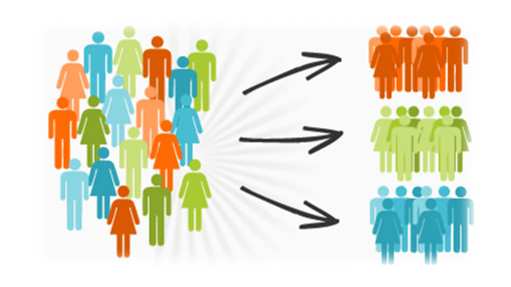
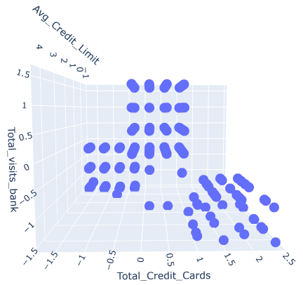
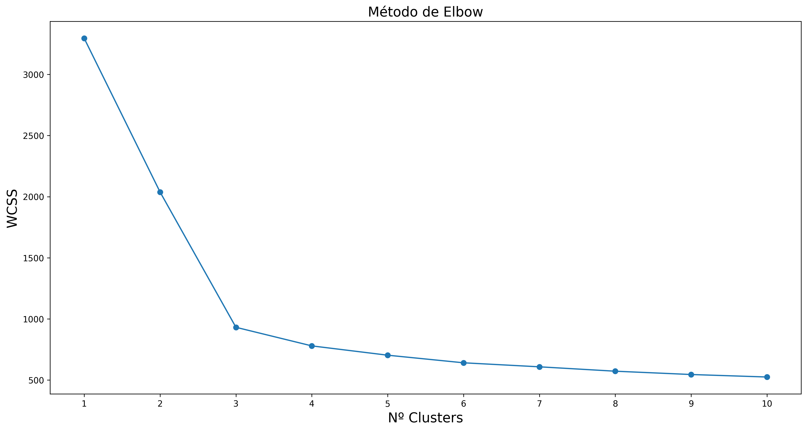
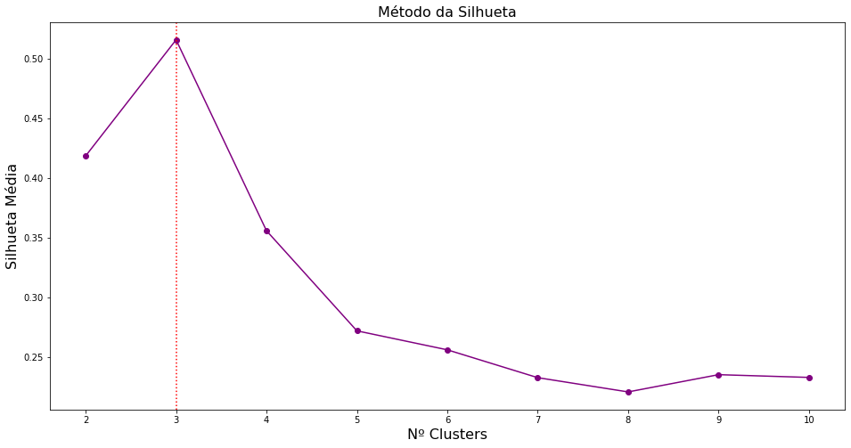
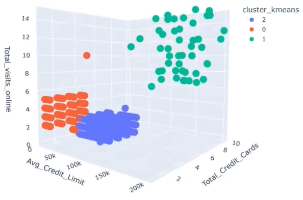
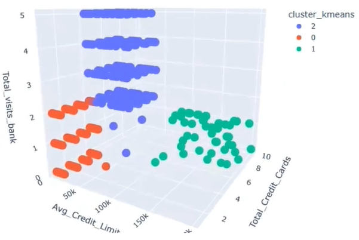
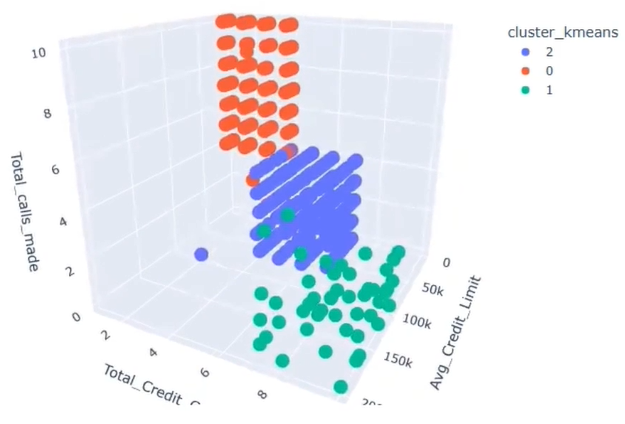

# credit-card-customer-clustering

# 🧠 Machine Learning: Clusterização de Clientes de uma Operadora de Cartão de Crédito

## 📌 Contexto

A **clusterização não supervisionada** é uma técnica de *machine learning* cujo objetivo é agrupar dados sem rótulos, buscando identificar padrões ou segmentos de forma autônoma.

No contexto de uma **operadora de cartão de crédito**, a clusterização permite identificar grupos de clientes com diferentes comportamentos de **lealdade à marca**, considerando variáveis como:

- Limite do cartão 💳  
- Quantidade de cartões 📇  
- Visitas ao banco 🏦  
- Chamadas telefônicas ☎️  

Essa análise ajuda na criação de **estratégias personalizadas** de marketing, atendimento e retenção.

---

## 🧪 Técnicas Utilizadas

Foram explorados diferentes algoritmos de clusterização:

| Algoritmo | Descrição |
|----------|-----------|
| **K-Means** | Agrupa os dados em *K* clusters, minimizando a distância intra-cluster. |
| **DBSCAN** | Agrupa pontos com base em densidade e identifica outliers. |
| **Hierarchical Clustering** | Cria uma árvore de agrupamento (*dendrograma*) com diferentes níveis de granularidade. |

> 🎯 Para este estudo, foi escolhido o **K-Means** como algoritmo principal.

---

🗂️ Carregamento e Exploração dos Dados
📁 Fonte dos dados

Dataset disponível no Kaggle:
https://www.kaggle.com/datasets/aryashah2k/credit-card-customer-data

⚖️ Padronização dos Dados

É essencial padronizar os dados antes da clusterização para evitar distorções causadas por escalas diferentes.

📊 Visualização 3D Inicial

### 🌐 Gráfico 3D (Antes da Clusterização)

📈 Identificação do Número de Clusters

🔹 Método Elbow

### 🔍 Elbow Method

🔸 Método da Silhueta

### 🔍 Silhouette Score

📍 Aplicação do K-Means

🧪 ANOVA para Validação Estatística

Verifica se há diferenças significativas entre os clusters.

✅ Todas as variáveis apresentaram p-valor < 0.05, indicando diferenças estatisticamente significativas.

📊 Visualização dos Clusters

🧭 Perspectiva 1

### 🧠 Clusterização - Perspectiva Online

🧭 Perspectiva 2

### 🧠 Clusterização - Perspectiva Online

🧭 Perspectiva 3

### 🧠 Clusterização - Perspectiva Online

🔍 Interpretação dos Clusters

Cluster:	Características	- Estratégias
0:	Alta renda, digitalizados, não ligam com frequência	- Ofertas premium, produtos de investimento, comunicação por e-mail 📧
1:  Renda baixa, usam telefone, menos digitalizados	- FAQs, tutoriais, cashback, app com funcionalidades intuitivas 📞📱
2:	Intermediários, preferem visitas presenciais	- Acompanhamento humano, estímulo à transição digital, consultoria financeira 👥🏦

✅ Conclusão

A clusterização de clientes é uma ferramenta poderosa para segmentar públicos e orientar estratégias de marketing, atendimento e retenção com base em dados reais.

Ela permite:

Identificar padrões de comportamento;

Criar ações personalizadas;

Aumentar a eficiência e rentabilidade;

Reduzir custos operacionais.

💡 O uso de modelos de machine learning não é apenas uma vantagem técnica, mas sim uma vantagem competitiva estratégica no setor financeiro.

📚 Referência

Kaggle Dataset: Credit Card Customer Data
